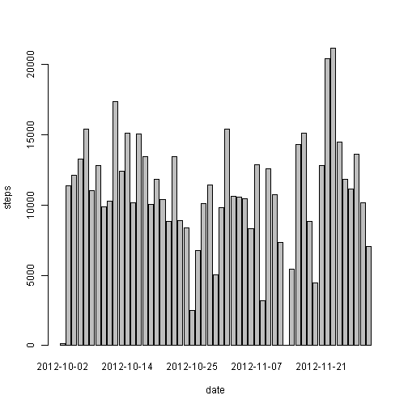
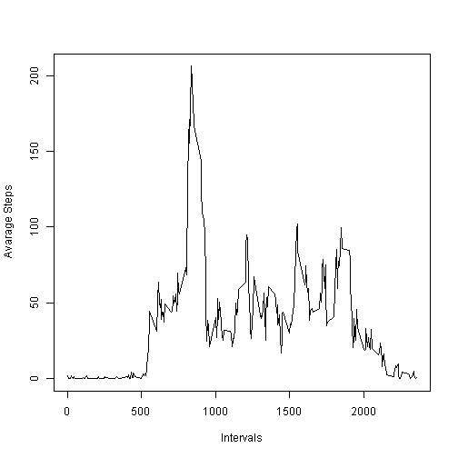
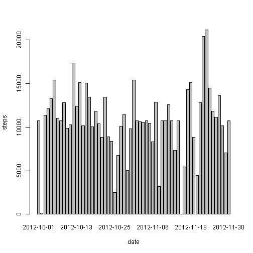
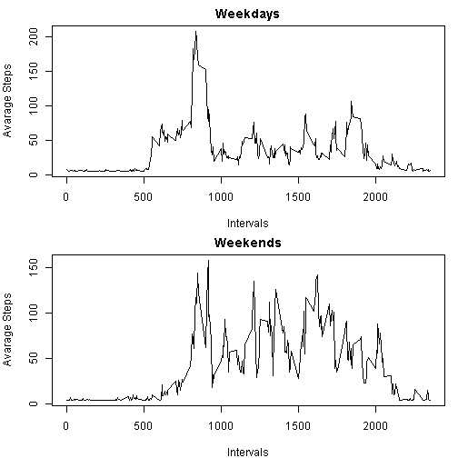

# Reproducible Research: Peer Assessment 1


## Loading and preprocessing the data


```r
# Loading Data
activityData = read.csv("activity.csv",na.strings="NA",header=TRUE) 
# Change Date column to Date Type
activityData$date = as.Date(activityData$date,format='%Y-%m-%d')
```

## What is mean total number of steps taken per day?

### Create Summary (sum,mean,and median) of steps grouped by day

```r
activitySummary = data.frame(date=character(),stepsSum=numeric(),stepsMean=numeric(),stepsMedian=numeric())
activitySummaryNA = data.frame(date=character(),stepsSum=numeric(),stepsMean=numeric(),stepsMedian=numeric())
for(date in unique(strftime(activityData$date) ) )
  {
    actTemp    = activityData[which(strftime(activityData$date)==date),1]
    sumTemp    = sum(actTemp,na.rm=T)
    meanTemp   = mean(actTemp,na.rm=T)
    medianTemp = median(actTemp,na.rm=T)
    if (sumTemp!=0)
      {
       #  Remove NA's
       activitySummary= rbind(activitySummary,data.frame(date=date,stepsSum=sumTemp,stepsMean=meanTemp,stepsMedian=medianTemp)) 
      }
    #  Retain NA's
    activitySummaryNA= rbind(activitySummaryNA,data.frame(date=date,stepsSum=sumTemp,stepsMean=meanTemp,stepsMedian=medianTemp))
  }
activitySummary$date = as.Date(activitySummary$date,format='%Y-%m-%d')
activitySummaryNA$date = as.Date(activitySummaryNA$date,format='%Y-%m-%d')
```
### Summary Per day

```r
head(activitySummary)
```

```
##         date stepsSum stepsMean stepsMedian
## 1 2012-10-02      126    0.4375           0
## 2 2012-10-03    11352   39.4167           0
## 3 2012-10-04    12116   42.0694           0
## 4 2012-10-05    13294   46.1597           0
## 5 2012-10-06    15420   53.5417           0
## 6 2012-10-07    11015   38.2465           0
```
### 1 - Histogram of the total number of steps taken each day

```r
barplot(activitySummary$stepsSum, names.arg = activitySummary$date, xlab = "date", ylab = "steps")
```

 
### 2 - Calculate and report the mean and median total number of steps taken per day
### Total Mean per day

```r
totalMean = mean(activitySummary$stepsSum,na.rm=T)
totalMean
```

```
## [1] 10766
```
### Total Median per day

```r
totalMedian = median(activitySummary$stepsSum,na.rm=T)
totalMedian
```

```
## [1] 10765
```

## What is the average daily activity pattern?

### 1 - Make a time series plot (i.e. type = "l") of the 5-minute interval (x-axis) and the average number of steps taken, averaged across all days (y-axis)

```r
activityIntervals = aggregate(activityData$steps~activityData$interval,FUN=mean)
colnames(activityIntervals) = c("interval","steps")
plot(activityIntervals, type = "l",xlab="Intervals",ylab="Avarage Steps")
```

 

### 2 - Which 5-minute interval, on average across all the days in the dataset, contains the maximum number of steps?

```r
maxInterval = activityIntervals[which(activityIntervals$steps==max(activityIntervals$steps)),]
maxInterval
```

```
##     interval steps
## 104      835 206.2
```

## Imputing missing values

### 1 - Calculate and report the total number of missing values in the dataset (i.e. the total number of rows with NAs)

```r
activityNaSteps = activityData[is.na(activityData$steps),]
length(activityNaSteps$steps)
```

```
## [1] 2304
```

### 2 - Devise a strategy for filling in all of the missing values in the dataset. The strategy does not need to be sophisticated. For example, you could use the mean/median for that day, or the mean for that 5-minute interval, etc.

#### Filling NA's using mean of the same day or the mean for that 5-minute interval if the mean of the same date is NA

```r
activityDataWithoutNA = activityData
meanOfFiveMinuts = mean(activityIntervals$steps)
for(date in unique(strftime(activityData$date) ) )
  {
    dateMean = activitySummaryNA[which(strftime(activitySummaryNA$date)==date),3]
    if (is.na(dateMean))
      {
        dateMean = meanOfFiveMinuts
      }
    activityDataWithoutNA[which(strftime(activityDataWithoutNA$date)==date & is.na(activityDataWithoutNA$steps) ),1]=dateMean
  }
activityDataWithoutNA$date = as.Date(activityDataWithoutNA$date,format='%Y-%m-%d')
```

### 3 - Create a new dataset that is equal to the original dataset but with the missing data filled in 

```r
head(activityDataWithoutNA)
```

```
##   steps       date interval
## 1 37.38 2012-10-01        0
## 2 37.38 2012-10-01        5
## 3 37.38 2012-10-01       10
## 4 37.38 2012-10-01       15
## 5 37.38 2012-10-01       20
## 6 37.38 2012-10-01       25
```

### 4 - Make a histogram of the total number of steps taken each day and Calculate and report the mean and median total number of steps taken per day. Do these values differ from the estimates from the first part of the assignment? What is the impact of imputing missing data on the estimates of the total daily number of steps?

```r
activityStepsPerDay= aggregate(activityDataWithoutNA$steps~activityDataWithoutNA$date,FUN=sum)
colnames(activityStepsPerDay) = c("date","totalSteps")
barplot(activityStepsPerDay$totalSteps, names.arg = activityStepsPerDay$date, xlab = "date", ylab = "steps")
```

 
### Total Mean per day

```r
mean(activityStepsPerDay$totalSteps,na.rm=T)
```

```
## [1] 10766
```
### Total Median per day

```r
median(activityStepsPerDay$totalSteps,na.rm=T)
```

```
## [1] 10766
```
#### I could't find big differance after filling the missing values

## Are there differences in activity patterns between weekdays and weekends?

### 1 - Create a new factor variable in the dataset with two levels - "weekday" and "weekend" indicating whether a given date is a weekday or weekend day.

```r
activityDataWithoutNA$dayType = "Weekday"
for(date in unique(strftime(activityDataWithoutNA$date) ) )
  {
    if (weekdays(as.Date(date,format='%Y-%m-%d')) %in% c("Saturday", "Sunday"))
      {
        activityDataWithoutNA[which(strftime(activityDataWithoutNA$date)==date),4] = "Weekend" 
      }
    else
      {
        activityDataWithoutNA[which(strftime(activityDataWithoutNA$date)==date),4] = "Weekday"
      }
  }
activityDataWithoutNA$dayType = as.factor(activityDataWithoutNA$dayType)
table(activityDataWithoutNA$dayType)
```

```
## 
## Weekday Weekend 
##   12960    4608
```
### 2 - Make a panel plot containing a time series plot (i.e. type = "l") of the 5-minute interval (x-axis) and the average number of steps taken, averaged across all weekday days or weekend days (y-axis). 

```r
stepsPerWeekday= aggregate(activityDataWithoutNA$steps~activityDataWithoutNA$interval,subset=(activityDataWithoutNA$dayType=="Weekday"),FUN=mean)
stepsPerWeekend= aggregate(activityDataWithoutNA$steps~activityDataWithoutNA$interval,subset=(activityDataWithoutNA$dayType=="Weekend"),FUN=mean)
par(mfrow = c(2, 1),mar = c(4, 4, 2, 1))
plot(stepsPerWeekday, type = "l",xlab="Intervals",ylab="Avarage Steps",main="Weekdays")
plot(stepsPerWeekend, type = "l",xlab="Intervals",ylab="Avarage Steps",main="Weekends")
```

 
